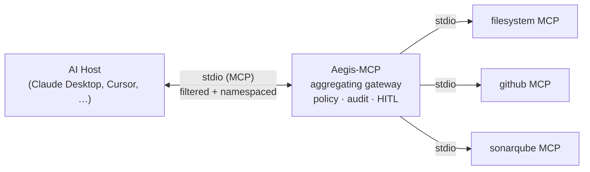

# Aegis-MCP

**A zero-trust security gateway for the Model Context Protocol (MCP).**

Aegis-MCP sits as a single MCP server between an AI host (Claude Desktop, Cursor, …) and
any number of downstream MCP servers, and enforces capability-level scopes on every
transaction. Instead of granting a downstream server blanket access, Aegis exposes only
the tools and resources permitted by the currently **active profile**, namespaces every
tool by its origin server (`filesystem__read_file`) so tools cannot be spoofed or
shadowed, and gates profile escalations through an explicit transition graph with
non-blocking human-in-the-loop approval. Every security decision is written to a
structured audit log.



More diagrams — use cases, enforcement and approval flows, the approval lifecycle —
in [docs/diagrams.md](docs/diagrams.md).

This repository contains **Cycle 1**: the open-source local sidecar. See
[Roadmap](#roadmap) for what's next.

## Why

MCP inherits structural gaps from JSON-RPC 2.0: unregulated tool connections enable prompt
injection, tool poisoning, broad token passthrough, and command execution. Aegis is a
protocol-specific firewall for MCP traffic, built on the zero-trust principles in
Anthropic's *Zero Trust for AI Agents*: **assume breach, verify every interaction, least
privilege, agent identity, continuous monitoring**.

## How it runs

Aegis is a single Go binary that speaks MCP over stdio. Point your host at it and let it
dial the downstream servers declared in the config.

```sh
make build
AEGIS_CONFIG=testdata/aegis.yaml ./aegis   # run the gateway (stdio MCP server)
./aegis approve apr_1                      # approve a pending profile switch
./aegis deny apr_1                         # deny it instead
```

- `AEGIS_CONFIG` selects the policy file (defaults to `aegis.yaml`). If it cannot be
  loaded or validated, Aegis refuses to start (**fail-closed**, exit 1).
- Each configured downstream server is dialed as a stdio subprocess. If a server fails to
  start it is skipped (per-server fail-closed) and the rest continue.
- Audit records are JSON lines on **stderr** by default, or an append-only file if
  `AEGIS_AUDIT_LOG=<path>` is set — never stdout, which is reserved for the MCP
  protocol ([ADR 007](docs/architecture/ADR_007_audit_stream_off_stdout.md)).
  Approval prompts also go to stderr.

## The profile model

A profile is a named set of capabilities, declared in `aegis.yaml`:

- `allow` — tool capabilities (`server.tool`, or `server.*` glob) the profile may call.
- `resources` — resource URI patterns (`file:///repo/**`) the profile may list/read,
  matched host-aware and traversal-safe.
- `extends` — inherit another profile's `allow`/`resources`.
- `allowed_transitions` — which profiles this profile may switch to **without** human
  approval (the switch-authorization graph).
- `activation.default_profile` — the profile Aegis starts in.
- `error_disclosure` — `verbose` (tell the agent which profile would grant a denied
  capability) or `minimal` (don't, for hardened deployments).

The host (agent) requests a switch via the `aegis.set_profile` meta-tool:

- If the target is in the active profile's `allowed_transitions`, the switch happens
  immediately.
- Otherwise Aegis returns `AEGIS_PENDING_APPROVAL` with an approval id, prints a prompt to
  stderr, and keeps the old profile active. A human decides out-of-band by running
  `aegis approve <id>` (or `aegis deny <id>`) — delivered to the running gateway over a
  per-user unix socket ([ADR 008](docs/architecture/ADR_008_approval_ipc_unix_socket.md));
  the agent then calls `aegis.approval_status` to apply it, and the applied switch is
  audited as a human decision. Approvals are **single-use** and **bound to the profile
  they were granted from**.

Tools and resources outside the active profile are invisible in `tools/list` /
`resources/list` and blocked (with a structured `AEGIS_CAP_DENIED` /
`AEGIS_RESOURCE_DENIED` error) if called directly.

## Repository layout

```
cmd/aegis/                 Entrypoint: load config, dial downstreams, serve over stdio (fail-closed)
internal/                  All logic. Split into a network-free "pure core" and an "I/O shell".
  config/                  aegis.yaml schema, loading, and fail-closed validation
  policy/                  PURE CORE — compiled policy: tool-glob matching, host-aware
                           traversal-safe resource URI matching, the transition graph
  enforcer/                PURE CORE — the chokepoint: filter *_list, authorize *_call
  profilestate/            PURE CORE — active profile + switch authorization (graph + HITL routing)
  approval/                PURE CORE — non-blocking pending-approval store + terminal channel
  naming/                  PURE CORE — server__tool wire names, collision detection, anti-shadowing
  aegiserr/                PURE CORE — stable structured errors with configurable disclosure
  audit/                   PURE CORE — structured JSON decision log (one record per decision)
  approvalipc/             `aegis approve/deny <id>` → running gateway, over a per-user unix socket
  gateway/                 I/O SHELL — adapts the official MCP Go SDK to the pure core:
                           DownstreamClient seam, registry, router, Core, the enforcing
                           middleware (server.go), and the real-SDK end-to-end tests
testdata/aegis.yaml        Sample policy (filesystem / github / sonarqube; default/code-review/deploy)
docs/architecture/         ADR_001–009: the key design decisions and their rationale
docs/diagrams.md           Use-case, flow, sequence, and state diagrams (Mermaid)
docs/superpowers/specs/    Full design spec (Cycle 1)
docs/superpowers/plans/    The task-by-task implementation plan
```

**Architecture in one sentence:** a security-critical *pure core* with no network or SDK
dependency (so it can be reasoned about and unit-tested exhaustively), wrapped by a thin
*gateway* shell that installs a single receiving middleware as the protocol-boundary
chokepoint — nothing reaches a downstream server without passing core authorization. See
[ADR 006](docs/architecture/ADR_006_go_sdk_and_core_shell_split.md).

## Security properties

Enforced and regression-tested (verified by two adversarial review rounds):

- **Default-deny** everywhere — unknown profiles and unlisted capabilities/resources are denied.
- **No agent self-elevation** — an agent can only switch along a pre-declared edge;
  anything else requires a human. Defeats both vertical escalation and lateral spread
  between disjoint same-level profiles. ([ADR 002](docs/architecture/ADR_002_transition_graph_not_tiers.md))
- **Traversal-safe, host-aware resource scoping** — `../`/encoded traversal is rejected,
  and patterns scoped to one repo/host can't be bypassed by another. ([ADR 004](docs/architecture/ADR_004_traversal_safe_resource_matching.md))
- **Anti-shadowing** — origin-namespaced tool names + startup collision detection. ([ADR 005](docs/architecture/ADR_005_tool_name_namespacing.md))
- **Non-blocking HITL** — escalations never hold the JSON-RPC call open (no host deadlock);
  approvals are single-use and context-bound. ([ADR 003](docs/architecture/ADR_003_non_blocking_hitl.md))
- **Fail-closed** — bad config, an unopenable audit log, or an unbindable approval
  socket refuses to start; an unreachable downstream drops out rather than opening
  access; every denial — and every applied human approval — is audited, never silent.

## Build and test

Requires Go 1.26+ (the version `go.mod` targets). The only external dependency is the
official `github.com/modelcontextprotocol/go-sdk` v1.7.0 (plus `gopkg.in/yaml.v3`).
The SDK negotiates the protocol version per connection, so both classic
(2025-06-18/2025-11-25) hosts and downstream servers on either side of the
2026-07-28 spec work; see
[ADR 009](docs/architecture/ADR_009_mcp_spec_2026_07_28_posture.md).

```sh
make build          # build ./aegis
make test           # go test ./...
make cover          # go test -cover ./...
go test -race ./... # race detector (gateway maps are mutex-guarded)
```

The pure-core packages sit at 82–100% coverage; the SDK-facing `gateway` at ~88%. The
end-to-end tests in `internal/gateway/` exercise a **real** MCP SDK server over an
in-memory transport, and a real stdio subprocess — not mocks. CI runs build, vet, and
the race-enabled suite on every push and pull request.

## Manual acceptance test

1. `make build`.
2. Configure your host (Claude Desktop / Cursor) to launch Aegis as an MCP server:
   - command: the built `./aegis` binary
   - env: `AEGIS_CONFIG=/abs/path/to/testdata/aegis.yaml`
3. In the host, list available tools. Confirm:
   - Only `default`-profile capabilities appear, namespaced by origin (`filesystem__read_file`).
   - The meta-tools `aegis.set_profile` and `aegis.approval_status` are present.
   - High-privilege tools such as `github__deploy` are **not** listed.
4. Ask the agent to call a non-listed tool (e.g. `github__deploy`): expect an
   `AEGIS_CAP_DENIED` error, with the denial in the audit log on stdout.
5. Ask the agent to `set_profile` to `code-review` (a declared transition): it succeeds
   (`code=OK active=code-review`) and the additional tools become visible.
6. Ask the agent to `set_profile` to `deploy` from `default` (not a direct edge): expect
   `AEGIS_PENDING_APPROVAL` and a prompt on stderr; the profile stays unchanged until a
   human approves.
7. In another terminal, run `aegis approve <id>` with the id from the prompt (expect `ok`),
   then have the agent call `aegis.approval_status` with that id: the switch applies, the
   `deploy` tools become visible, and the audit log records the switch with
   `"source":"human"`.

## Roadmap

Aegis is open-core: the local sidecar is OSS; a central control plane is the commercial layer.

- **Cycle 1 — this repo (done):** aggregating proxy, default-deny policy, context profiles,
  traversal-safe resource matching, tool namespacing, non-blocking HITL, audit log.
- **Cycle 2:** kernel sandboxing (seccomp/Seatbelt) + egress/DNS control for downstream servers.
- **Cycle 3:** OAuth 2.1/PKCE token broker (Client ID Metadata Documents; DCR is
  deprecated as of MCP 2026-07-28) + central control plane (fleet policy, audit
  aggregation, dashboards).

Deferred within Cycle 1 (tracked in the [spec](docs/superpowers/specs/2026-06-15-aegis-mcp-gateway-design.md) §10):
argument-level constraints, resource *content*-injection inspection, and timed approval expiry.

## Documentation

- Design spec — `docs/superpowers/specs/2026-06-15-aegis-mcp-gateway-design.md`
- Implementation plan — `docs/superpowers/plans/2026-06-15-aegis-mcp-gateway-cycle1.md`
- Architecture decisions — `docs/architecture/ADR_001`…`ADR_009`
- Diagrams — [docs/diagrams.md](docs/diagrams.md)
- Reporting vulnerabilities — [docs/SECURITY.md](docs/SECURITY.md)
- Contributing — [docs/CONTRIBUTING.md](docs/CONTRIBUTING.md)

## License

Apache License 2.0 — see [LICENSE](LICENSE).
