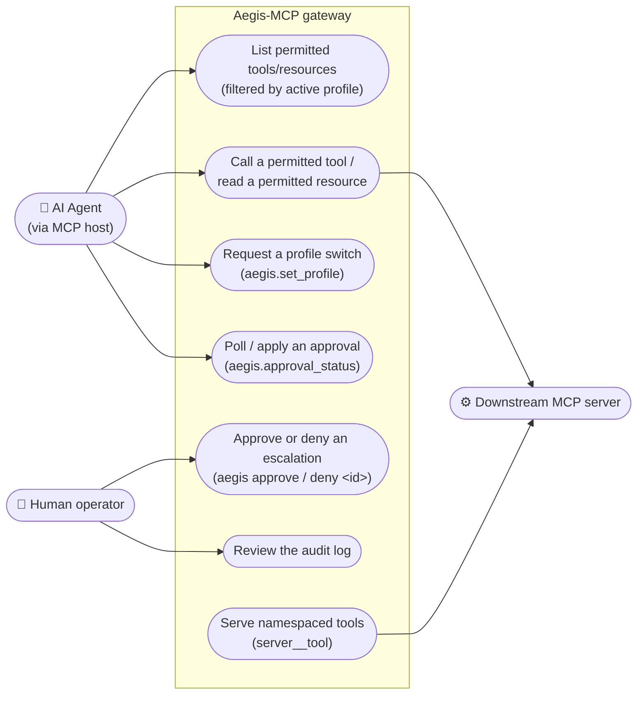
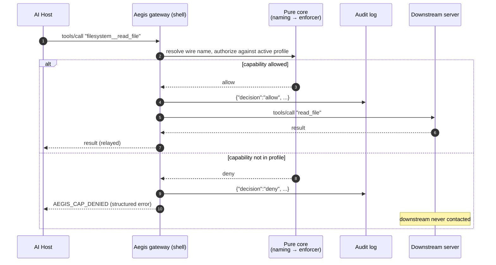
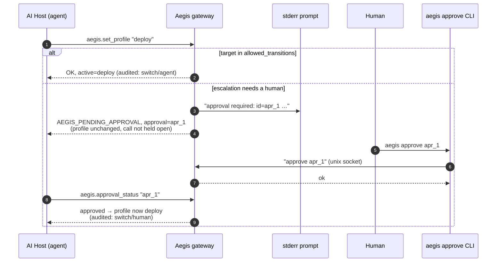
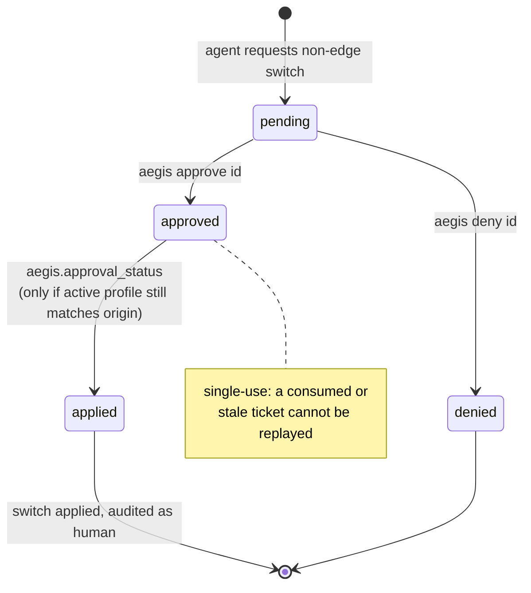
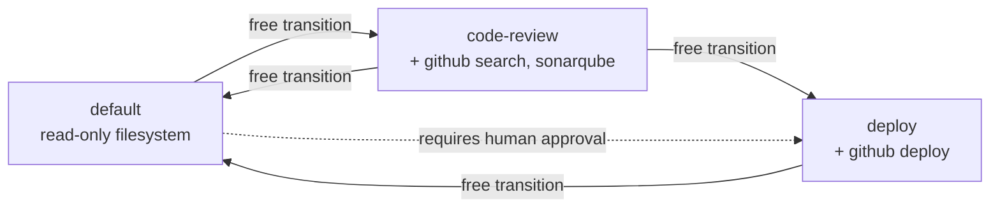

# Aegis-MCP — Diagrams

All diagrams are [Mermaid](https://mermaid.js.org/) and render directly on GitHub.
The topology diagram lives in the [README](../README.md); the enforcement flow inside
the gateway is also in the [design spec §6.2](superpowers/specs/2026-06-15-aegis-mcp-gateway-design.md).

## Use cases

Mermaid has no native use-case diagram type; this is the standard flowchart emulation
(actors outside, use-case ellipses inside the system boundary).

## Tool-call enforcement flow

Every `tools/call` (and `resources/read`) passes the single middleware chokepoint;
nothing reaches a downstream server without core authorization
([ADR 006](architecture/ADR_006_go_sdk_and_core_shell_split.md)).

## Profile switch with human approval (HITL)

Non-blocking by design ([ADR 003](architecture/ADR_003_non_blocking_hitl.md)); the
decision travels over a per-user unix socket
([ADR 008](architecture/ADR_008_approval_ipc_unix_socket.md)).

## Approval lifecycle

Approvals are single-use and bound to the profile they were granted from
([ADR 003](architecture/ADR_003_non_blocking_hitl.md)).

## Profile transition graph (sample policy)

The graph from `testdata/aegis.yaml`: solid edges switch without approval; anything
else — including the dashed example — requires a human
([ADR 002](architecture/ADR_002_transition_graph_not_tiers.md)).

