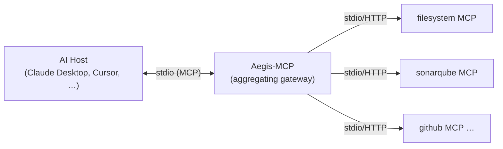
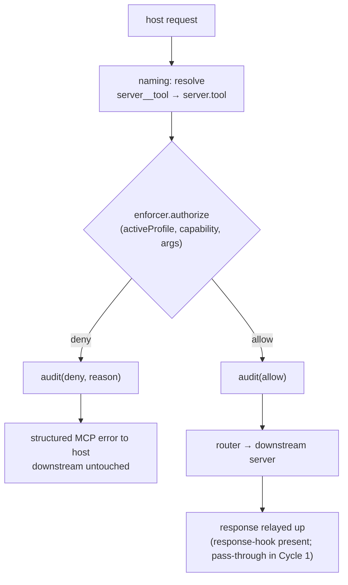

# Aegis-MCP — Zero-Trust MCP Security Gateway

**Design spec — Cycle 1 (OSS local sidecar)**
Date: 2026-06-15
Status: Draft for review

---

## 1. Context & Problem

The Model Context Protocol (MCP) is the de-facto standard for connecting tools to AI
agents, but it inherits structural gaps from JSON-RPC 2.0. Unregulated connection of
local and remote MCP servers enables prompt injection, tool poisoning, broad token
passthrough, and remote command execution. There is no protocol-specific, enterprise
firewall for MCP traffic.

This design is grounded in Anthropic's *Zero Trust for AI Agents* framework, which
names the threat categories — **prompt injection, tool poisoning, token passthrough,
supply-chain, sleeper agents** — and the principles: **assume breach, verify every
interaction, least privilege, agent identity, continuous monitoring**, with controls
including **capability-based scoping, response validation, human-in-the-loop approval,
sandbox isolation, and audit trails**.

### Product framing (open-core)

Aegis-MCP is a commercial open-core product:

- **OSS — local sidecar** (adoption driver): runs on the developer machine between the
  AI host and local MCP servers. Enforces capability scopes and context-aware tool
  filtering. *This is Cycle 1.*
- **Enterprise — central control plane** (monetized): fleet policy distribution, audit
  aggregation/dashboards, OAuth brokering. Later cycles.

### Roadmap (sets the boundary of this spec)

- **Cycle 1 (this spec):** aggregating proxy + capability scopes + context-aware
  filtering (explicit-gate). Userland Go, cross-platform.
- **Cycle 2:** kernel sandboxing (seccomp/Seatbelt) + egress/DNS control for downstream
  servers.
- **Cycle 3:** OAuth 2.1 / PKCE token broker + central control plane (enterprise).

Anything not in Cycle 1 is explicitly out of scope here.

---

## 2. Goals & Non-Goals

### Goals (Cycle 1)

1. Sit transparently between an AI host (Claude Desktop, Cursor) and N downstream MCP
   servers as a single aggregating proxy.
2. Present the host only the tools permitted by the **active profile** (context-aware
   filtering), enforced at `tools/list`.
3. Authorize every `tools/call` against a declarative, default-deny policy; deny and
   audit everything else, without touching the downstream server.
4. Provide a runtime profile switch (`aegis.set_profile`) governed by an explicit
   **transition graph** (`allowed_transitions` per profile): listed targets are
   agent-autonomous, every other switch requires **non-blocking human-in-the-loop (HITL)
   approval**. Defeats both vertical escalation and lateral spread between disjoint
   profiles (see §4.6).
5. **Namespace-prefix** all downstream tool names presented upward to prevent tool
   shadowing, while preserving tool descriptions + advertising server `instructions` so
   the model isn't semantically stranded (see §4.7).
6. Apply profile filtering to `resources/*` and `prompts/*` as well as tools, using
   **traversal-safe URI-template / regex matching** for resource URIs — least-privilege
   surface reduction across all four endpoint families (see §3, §4.5).
7. Emit a structured audit record for every security decision.
8. Return **structured, machine-readable errors** (stable code + capability), including a
   non-blocking `AEGIS_PENDING_APPROVAL` for escalations, so the agent orchestrator can
   preserve state instead of deadlocking or retry-looping; policy detail configurable (§7).
9. Fail closed in every error path.

### Non-Goals (Cycle 1)

- Kernel sandboxing, seccomp/Seatbelt, egress/DNS filtering (Cycle 2).
- OAuth/PKCE token brokering, remote/SaaS server auth (Cycle 3).
- Central control plane, dashboards, fleet policy sync (Cycle 3).
- LLM/semantic intent inference for context (explicitly rejected for the security path).
- Argument-level constraint enforcement (schema reserved; not enforced — see §4).
- Host-facing HTTP transport; downstream HTTP (fast-follow, interface reserved).
- **Content-level inspection of resource/prompt payloads** for injection (a separate,
  harder control — hook reserved, deferred). Cycle 1 reduces *which* resources are
  reachable, not whether an allowed resource carries a malicious payload.

---

## 3. Architecture & Topology

Single Go binary, userland only, cross-platform. Built on an existing MCP Go SDK rather
than hand-rolling JSON-RPC. **Aggregating proxy (1:N)**: the host is configured to talk
to exactly one MCP server — Aegis — which fronts all downstream servers and presents a
single filtered tool surface upward.



**Why aggregator, not 1:1 wrapper.** Context-aware filtering is a cross-server decision
("show filesystem + git, hide SonarQube unless in `code-review`"). Only a component that
sees all downstream servers at once can rewrite the unified `tools/list`. Trade-off: a
single point of latency/failure and more complexity — accepted, because that single
chokepoint is exactly the audit/enforcement point Zero-Trust wants.

**Transports (Cycle 1):** host-facing **stdio** only. Downstream **stdio** first; the
downstream connector interface is designed so **Streamable HTTP** is a drop-in
fast-follow.

**Enforcement chokepoints (Cycle 1):** the active profile is enforced across **all four
endpoint families** — `tools/list` + `tools/call`, `resources/list` + `resources/read`,
and `prompts/list` + `prompts/get`. Listing endpoints are filtered to the profile's
allow-list; access endpoints authorize each request and deny + audit anything outside it.
This closes the resource/prompt surface that would otherwise let an agent reach context
disabled in its current profile. A response/content-inspection hook exists at the relay
point but performs only pass-through in Cycle 1 (payload-level injection defense lands
later — see Non-Goals).

**Tool-name namespacing (anti-shadowing):** Aegis never passes downstream tool names
through 1:1. Every tool is exposed upward under a server-namespaced wire name
(`github__search`, `filesystem__search`), preventing a malicious server from registering
a colliding name to hijack a legitimate tool. The internal policy identifier stays
`server.tool`; only the wire name is prefixed (see §4.7).

---

## 4. Policy Model & Scopes

Single declarative YAML file `aegis.yaml`. **Default-deny** everywhere. Three blocks.

### 4.1 `servers` — downstream servers Aegis manages

```yaml
servers:
  filesystem: { transport: stdio, command: "mcp-server-filesystem", args: ["/repo"] }
  sonarqube:  { transport: stdio, command: "mcp-sonarqube" }
  github:     { transport: stdio, command: "mcp-github" }
```

### 4.2 `profiles` — named contexts, allow-lists over `server.tool`

```yaml
profiles:
  default:
    allow:        ["filesystem.read_file", "filesystem.list_dir", "github.search_*"]
    resources:    ["file:///repo/**"]                 # URI-template / regex (§4.5)
    allowed_transitions: ["code-review"]              # agent-autonomous switches (§4.6)
  code-review:
    extends: default
    allow:        ["sonarqube.*", "github.get_pull_request", "github.create_review_comment"]
    allowed_transitions: ["default"]
  deploy:
    allow:        ["github.*"]
    allowed_transitions: []                            # no autonomous exit; HITL only
```

- Capability identifier = `server.tool` (internal); wire name is namespaced (§4.7).
- `allow` is the tool allow-list; glob supported in the tool segment (`sonarqube.*`).
- `resources` is a **separate** allow-list using traversal-safe URI matching (§4.5),
  because resource URIs are dynamic templates, not discrete tool names.
- `extends` composes a profile from a base (union of allow-lists).
- `allowed_transitions` is the **switch authorization graph** (§4.6) — there is no `tier`;
  the explicit graph is the single switch-authority, which closes lateral spread.
- Default-deny: anything not matched by the active profile is hidden from the `*/list`
  endpoints and rejected at the access endpoints.

### 4.3 `activation` — how the active profile is chosen

```yaml
activation:
  default_profile: default
  explicit: true        # runtime switching via aegis.set_profile / CLI
  # signals: [...]      # Cycle 1.x — reserved, not enforced
```

MVP = **explicit switch only**. The schema reserves `signals` (workspace path, host
identity, git branch/PR state, time window) so deterministic auto-activation can be added
without breaking the file format.

### 4.4 Wildcard policy

Glob is allowed inside profile allow-lists as operator convenience. The pattern
the original product sketch bans — a *blind, per-server blanket grant* handed to a server — does not exist
in this model: there is no per-server grant at all. All access flows through profile
allow-lists, each an explicit operator choice.

### 4.5 Resource URI matching (traversal-safe) + argument constraints

**Resource matching (Cycle 1).** Unlike tools (discrete `server.tool` names), MCP
resources use dynamic URI templates (`file:///repo/{path}`, `github://repo/pulls/{id}`).
Simple globbing is both insufficient and dangerous. The `policy` module therefore matches
the per-profile `resources` allow-list with **URI-template / regex** patterns, and —
critically — **canonicalizes the requested URI before matching**:

- Decode percent-encoding, normalize the path, and resolve/strip `.`/`..` segments.
- **Reject** any URI that, after normalization, escapes the matched prefix (path
  traversal), even if the raw string superficially matches a glob.
- Match against the canonical form only; never the raw attacker-supplied string.

So `file:///var/log/app/*.log` cannot be tricked by `file:///var/log/app/../../etc/passwd`
or its encoded variants. This applies to `resources/list` (filtering) and
`resources/read` (authorization).

**Argument-level constraints (reserved, not enforced in Cycle 1).** A `where:` field is
reserved on tool allow entries for future argument constraints (e.g. `filesystem.write`
only under `/repo`). **Not enforced in Cycle 1.** Top Cycle 1.x enhancement, since
Anthropic least-privilege wants it.

### 4.6 Profile switching — transition graph with non-blocking HITL

Aegis exposes one built-in meta-tool, `aegis.set_profile(name)` (plus `aegis.approval_status(id)`
and an equivalent CLI/control command). Switching to a non-existent profile is always
denied and audited. **The gate is always the file, never the agent's assertion.**

Switching is authorized by the **explicit transition graph** — each profile's
`allowed_transitions` — not by tiers. This defeats *both* vertical escalation and lateral
spread between disjoint same-cost profiles (e.g. `frontend-dev → db-analytics`):

| Requested switch | Source | Result |
|---|---|---|
| Target ∈ current profile's `allowed_transitions` | agent (`set_profile`) | allowed immediately, audited |
| Target ∉ `allowed_transitions` (and exists) | agent (`set_profile`) | **routed to non-blocking HITL** |
| Non-existent target | agent | denied, audited |
| Any existing target | human via CLI/control | allowed (subject to policy), audited |

A switch is autonomous **only** along a pre-declared safe edge. Every other agent-initiated
switch requires a human — which means a compromised agent can neither escalate nor wander
laterally into an unrelated tool-set.

**Non-blocking HITL (Cycle 1).** Aegis does **not** hold the JSON-RPC call open waiting
for a human (that risks host/framework timeouts and deadlock). Instead, on a switch that
needs approval it **returns immediately** with `AEGIS_PENDING_APPROVAL` + an `approval_id`,
and emits an out-of-band approval request to the developer (terminal channel in Cycle 1;
pluggable interface for Slack/etc. later). The agent framework preserves its state and
later either re-issues `set_profile` (idempotent — succeeds once approved) or polls
`aegis.approval_status(approval_id)`. Human approve → switch + audit; deny or expiry →
profile unchanged + audit. The agent can never satisfy its own request.

### 4.7 Tool-name namespacing (anti-shadowing)

Downstream tool names are **never** surfaced 1:1. For every advertised tool, Aegis
presents the host a namespaced wire name `"<server>__<tool>"` (e.g. `github__search`)
and maps it back to `server.tool` internally on `tools/call`. Rationale: in a 1:N
aggregator, two servers can expose the same tool name, and a malicious/compromised server
can deliberately register a legitimate tool's name to redirect the agent (tool shadowing
/ poisoning). Prefixing makes every tool's origin explicit and unspoofable from the
host's view.

Implementation notes:
- Separator is `__` (double underscore), not `.`, because MCP tool names must match
  `^[a-zA-Z0-9_-]+$`; `server.tool` remains the internal policy identifier only.
- Name collisions in the namespaced space (same server + tool) are a config/registry
  error surfaced at startup, not silently merged.

**Avoiding LLM semantic friction.** Prefixing can strand a model that expects the
canonical `read_file`. Aegis mitigates this *without* dropping prefixing:
- **Server `instructions`** (returned at `initialize`, auto-surfaced by hosts) explain the
  convention: *"You are operating behind Aegis-MCP. Every tool is prefixed with its server
  origin via `__` (e.g. `filesystem__read_file`). Use the prefixed names as-is."* This is
  the primary mechanism — it reaches the model without user action.
- **Original descriptions are preserved** on the prefixed tool (origin appended), so the
  model retains the semantic anchor for what `filesystem__read_file` does.
- An explanatory **prompt** is offered as a secondary aid; it is *not* relied upon, since
  `prompts/*` are user-invoked, not auto-injected.

---

## 5. Components

Each unit has one responsibility and is testable in isolation.

| Unit | Responsibility | Depends on |
|---|---|---|
| `hostsession` | Speaks MCP over stdio to the AI host; upward-facing endpoint | MCP SDK |
| `registry` | Launches/connects downstream servers, tracks advertised tools/resources/prompts, lifecycle/reconnect | MCP SDK, policy |
| `naming` | Bidirectional map between namespaced wire names (`server__tool`) and internal `server.tool`; collision detection | — (pure) |
| `policy` | Loads/validates `aegis.yaml`; resolves tool `isAllowed`, **traversal-safe URI matching** for resources, and the `allowed_transitions` graph | — (pure after load) |
| `profilestate` | Holds active profile; authorizes switches against the transition graph; routes non-edge switches to `approval` | policy, approval |
| `approval` | Async **pending-request store**: issues `approval_id`, emits out-of-band request (terminal channel in Cycle 1; pluggable), records approve/deny/expiry — never blocks the RPC | — (channel iface) |
| `enforcer` | Chokepoint: filters `*/list`, authorizes `*/call`+`resources/read`+`prompts/get`, emits allow/deny + structured reason | policy, profilestate |
| `router` | Maps an allowed call to the right downstream server, forwards, relays response | registry, naming, enforcer |
| `audit` | Structured JSON decision log (decision, profile, capability, reason, ts) | — |

`policy`, `profilestate`, `enforcer`, `naming` are **pure logic** (no network) — the
security-critical core, unit-tested exhaustively. `approval` is pure decision logic
behind a channel interface (the terminal channel is mocked in tests). `hostsession`,
`registry`, `router` are the I/O shell, covered by integration tests against fake MCP
servers.

---

## 6. Data Flow

### 6.1 `*/list` (tools, resources, prompts)

```
host → hostsession → registry (gather all downstream items)
     → enforcer (drop everything the active profile disallows;
                 resources matched via traversal-safe URI rules)
     → naming (apply server__name prefixing; preserve+annotate descriptions)
     → audit → filtered, namespaced list → host
```

The host only ever sees items the active profile permits, each under an unspoofable
namespaced name. At `initialize`, Aegis returns server `instructions` explaining the
prefix convention (§4.7).

### 6.2 `*/call` (`tools/call`, `resources/read`, `prompts/get`)



### 6.3 `aegis.set_profile` / `aegis.approval_status`

Intercepted at `hostsession`, never forwarded downstream. Handled by `profilestate`:
resolve target → check current profile's `allowed_transitions`.
- **Edge present** → switch + audit, return new active profile.
- **Edge absent (target exists)** → `approval` issues an `approval_id`, fires the
  out-of-band request, and `set_profile` **returns immediately** with
  `AEGIS_PENDING_APPROVAL` (no blocking). Human approve → switch + audit; deny/expiry →
  unchanged + audit. The agent re-issues `set_profile` (idempotent) or polls
  `aegis.approval_status(approval_id)` → `pending | approved | denied | expired`.
- **Non-existent target** → denied + audit.

---

## 7. Error Handling — Fail Closed

- **Downstream server crash/unreachable:** its items drop from the `*/list` endpoints;
  calls to it return a clean MCP error; Aegis stays up (per-server fail-closed).
- **Malformed `aegis.yaml`:** refuse to start with a precise validation error. Never
  fail open to "allow all."
- **Unknown/denied capability:** explicit MCP error to the host, audited. Downstream
  never touched.
- **Switch needing approval:** **non-blocking** — returns `AEGIS_PENDING_APPROVAL` + an
  `approval_id` at once; profile unchanged until/unless a human approves. No held
  connection, so no host/framework deadlock. Deny/expiry → unchanged, audited. Agent
  cannot self-grant.
- Every denial is observable in the audit log; nothing fails silently.

**Structured errors.** Errors are never bare "Access Denied." Each carries a stable
machine-readable shape so the agent's orchestrator can pause/branch/resume instead of
retry-looping or corrupting idempotency:

```json
{ "code": "AEGIS_CAP_DENIED", "capability": "sonarqube.scan",
  "active_profile": "default", "required_profile": "code-review",
  "hint": "capability requires a profile that allows it" }
```

```json
{ "code": "AEGIS_PENDING_APPROVAL", "approval_id": "apr_7f3c",
  "requested_profile": "deploy", "active_profile": "default",
  "hint": "human approval requested; re-issue set_profile or poll aegis.approval_status" }
```

`code` is always a stable, documented enum; `code` + `capability` are always present on
denials. The policy-revealing field `required_profile` is **configurable**
(`error_disclosure: verbose|minimal`, default `verbose` for dev ergonomics): verbose aids
legitimate orchestration; minimal avoids handing a compromised agent a precise escalation
target in hardened deployments.

---

## 8. Audit Log

Structured JSON, one record per security decision:

```json
{ "ts": "...", "decision": "deny", "profile": "default",
  "capability": "sonarqube.scan", "reason": "not in active profile allow-list",
  "transport": "stdio", "host": "claude-desktop" }
```

Local file / stdout in Cycle 1. This is the seed of the enterprise audit-aggregation
product; the record schema is designed to be forwarded to the control plane later
without change.

---

## 9. Testing Strategy (TDD, ≥80% coverage)

Tests are written before implementation; regression suite grows per feature.

**Unit (pure core):**
- `policy`: glob (tools), default-deny, `extends`, `allowed_transitions` parsing,
  **URI-template matching + path-traversal rejection** (`../`, percent-encoded, escaping
  the prefix), validation errors, malformed-config rejection.
- `enforcer`: full allow/deny matrix over tools + resources + prompts; structured-error
  shape and `error_disclosure` modes.
- `profilestate`: edge-present switch allowed; **non-edge switch → pending (lateral
  spread blocked)**; non-existent denied; deny/expiry retains profile.
- `approval`: issues `approval_id`; approve / deny / expiry via a mocked channel;
  `approval_status` transitions; agent cannot self-approve; non-blocking (returns at once).
- `naming`: round-trip `server.tool` ↔ `server__tool`; collision detection; description
  preservation/annotation.

**Integration (I/O shell):**
- Spin up **fake downstream MCP servers** with known tool/resource/prompt sets, including
  **two servers exposing the same tool name** (shadowing test) and **resource URIs with
  traversal payloads**.
- Drive Aegis through a real MCP client over stdio.
- Assert: host sees only permitted, **namespaced** items + server `instructions`; denied
  calls never reach downstream; resource access is traversal-safe and profile-filtered; a
  non-edge agent `set_profile` **returns `AEGIS_PENDING_APPROVAL` immediately** (no block)
  and completes after the mocked human approves; downstream crash degrades gracefully.

**Smoke:** binary builds, starts with a sample `aegis.yaml`, connects a sample
downstream server, serves a filtered `tools/list` — proving end-to-end wiring.

Coverage measured with `go test -cover`; target ≥80% overall, with the pure core
(`policy`, `enforcer`, `profilestate`, `naming`, `approval`) at or near 100% — the
traversal-rejection and transition-graph paths are security-critical and exhaustively cased.

---

## 10. Open Questions / Deferred

- Exact MCP Go SDK choice (official `modelcontextprotocol/go-sdk` vs community) — confirm
  current maturity at implementation time.
- Config format final call: YAML assumed; HCL is a possible alternative if richer
  expression is wanted later.
- First deterministic activation signals to implement in Cycle 1.x (workspace path vs
  host identity vs git state).
- Default for `error_disclosure` (verbose vs minimal) — assumed `verbose` for dev
  ergonomics; revisit for hardened defaults.
- Pending-approval **expiry** default (how long an `approval_id` stays `pending` before
  `expired`) and whether expiry is configurable per profile.
- Whether `allowed_transitions` should also support an explicit hard-`deny` edge (vs the
  current "unlisted ⇒ HITL" default), for switches that should never even prompt.
```

